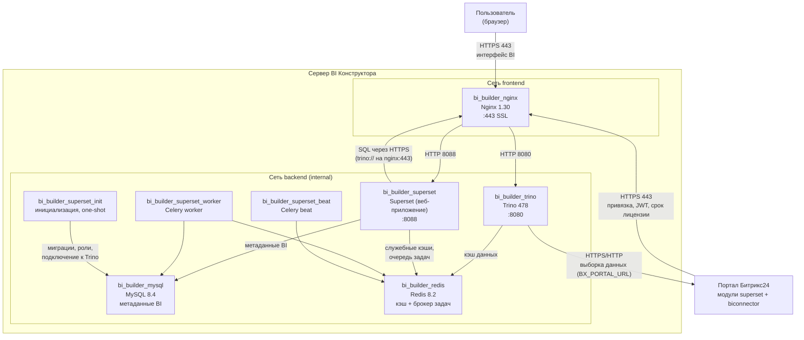

# Архитектура сборки BI Конструктора

Документ описывает внутреннее устройство самостоятельно размещаемой (self-hosted) сборки BI Конструктора Битрикс24: из каких контейнеров она состоит, за что отвечает каждый из них, как они взаимодействуют между собой и с порталом Битрикс24, и какие точки входа доступны пользователю.

## Оглавление

- [Общая картина](#overview)
- [Схема взаимодействия](#diagram)
- [Состав контейнеров](#containers)
- [Точки входа: что доступно пользователю](#entrypoints)
- [Сети](#networks)
- [Хранение данных](#storage)
- [Пути запросов](#requestflows)
- [Порядок запуска и зависимости](#startup)
- [Конфигурация](#configuration)
- [Изоляция и ограничение ресурсов](#hardening)
- [Связь с порталом Битрикс24](#portal)
- [Обновление версии](#upgrade)

---

<a id="overview"></a>
## Общая картина

BI Конструктор — это готовая сборка из восьми контейнеров, которая разворачивается на вашем сервере одной командой `docker compose up -d`. Она включает всё необходимое для работы: BI-платформу, движок распределённых запросов, базу метаданных, кэш и обратный прокси-сервер с SSL.

Три принципиальных свойства архитектуры:

1. **Бизнес-данные не копируются в BI Конструктор.** Внутренняя база данных сборки (MySQL) хранит только метаданные BI: описания подключений, датасетов, отчётов, дашбордов, пользователей и права доступа. Сами данные CRM, задач, бизнес-процессов и прочих сущностей остаются на портале Битрикс24 и запрашиваются в момент построения отчёта. Витрины данных не строятся, ETL-репликации нет.
2. **Единственная внешняя точка входа — HTTPS-порт прокси-сервера.** Движок запросов, база метаданных и кэш не публикуются наружу и живут во внутренней Docker-сети без доступа в интернет.
3. **Инициатор запроса данных — сборка, а не портал.** Портал не должен быть доступен из интернета для работы отчётов; достаточно, чтобы сервер BI Конструктора видел портал по сети.

<a id="diagram"></a>
## Схема взаимодействия



<a id="containers"></a>
## Состав контейнеров

| Контейнер                    | Образ                                                         | Роль                                                                                                                                                                                   | Публикуется наружу                                   |
|------------------------------|---------------------------------------------------------------|----------------------------------------------------------------------------------------------------------------------------------------------------------------------------------------|------------------------------------------------------|
| `bi_builder_nginx`           | `nginx:1.30-alpine`                                           | Обратный прокси и точка терминации SSL. Единственный внешний вход в систему                                                                                                            | Да, порт `443` (`NGINX_SUPERSET_PORT`)               |
| `bi_builder_superset`        | `quay.io/bitrix24/superset` (сборка Битрикс24 на базе Apache Superset 6.0) | Веб-приложение BI: интерфейс, REST API, авторизация, работа с отчётами и дашбордами                                                                                                    | Только диагностический порт `8088` (`SUPERSET_PORT`) |
| `bi_builder_superset_init`   | тот же образ                                                  | Разовая инициализация при первом запуске и после обновления: миграции схемы БД, создание администратора, роли и права, системное подключение к Trino. Завершается со статусом `Exited` | Нет                                                  |
| `bi_builder_superset_worker` | тот же образ                                                  | Фоновый обработчик (Celery): асинхронные запросы SQL Lab, генерация отчётов и превью, рассылки                                                                                         | Нет                                                  |
| `bi_builder_superset_beat`   | тот же образ                                                  | Планировщик (Celery beat): ставит в очередь регулярные задачи — запуск отчётов по расписанию, очистка журналов                                                                         | Нет                                                  |
| `bi_builder_trino`           | `quay.io/bitrix24/trino` (сборка Битрикс24 на базе Trino 478)              | Движок SQL-запросов. Разбирает запрос, обращается за данными к порталу Битрикс24 через коннектор `bi`, выполняет фильтрацию, соединения и агрегацию                                    | Нет                                                  |
| `bi_builder_mysql`           | `mysql:8.4-oracle`                                            | База метаданных BI: подключения, датасеты, графики, дашборды, пользователи, права, журнал запросов                                                                                     | Нет                                                  |
| `bi_builder_redis`           | `redis:8.2-alpine`                                            | Кэш данных, с которым работает Trino, а также служебные кэши приложения и очередь фоновых задач                                                                                        | Нет                                                  |

Фоновые обработчики (`worker` и `beat`) входят в сборку и работают штатно, но в текущих сценариях работы с порталом задачи через них не идут — они задействуются по мере появления функций, которым нужно фоновое выполнение.

Три контейнера Superset (`superset`, `worker`, `beat`) поднимаются из одного образа с одним и тем же конфигурационным файлом `superset_config.py` — различие только в запускаемой команде. Это гарантирует, что интерфейс и фоновые задачи видят одинаковые настройки, подключения и права.

<a id="entrypoints"></a>
## Точки входа: что доступно пользователю

Наружу сборка отдаёт минимум:

| Адрес                                   | Назначение                                                                    | Кому нужен              |
|-----------------------------------------|-------------------------------------------------------------------------------|-------------------------|
| `https://<адрес-сервера>/`              | Штатный доступ к интерфейсу BI Конструктора                                   | Пользователям и порталу |
| `https://<адрес-сервера>/login/?form=y` | Форма входа системного администратора. Только для диагностики                 | Администратору сборки   |
| `http://<адрес-сервера>:8088/`          | Прямое обращение к контейнеру Superset в обход прокси. Только для диагностики | Администратору сервера  |

Всё остальное недоступно извне по построению: Trino, MySQL и Redis не имеют публикуемых портов и находятся в изолированной сети. Обратиться к ним можно только с самого сервера через `docker compose exec`.

**Основной сценарий работы пользователя портала** — не прямой вход в интерфейс, а работа через раздел BI Конструктор на портале Битрикс24. Портал встраивает отчёты и редактор BI Конструктора в свой интерфейс и передаёт токен, по которому пользователь опознаётся в BI Конструкторе под своим порталом-аккаунтом со своими правами. Заводить пользователям отдельные учётные записи и отдельно настраивать им права в BI Конструкторе не требуется.

Учётная запись `admin` внутри сборки — системная. Её пароль (`BI_BUILDER_ADMIN_PASSWORD`) нужен для однократной привязки портала к BI Конструктору; для повседневной работы с отчётами она не предназначена.

<a id="networks"></a>
## Сети

Сборка использует две Docker-сети с разными задачами.

**`backend`** — внутренняя сеть (`internal: true`). У контейнеров в ней нет маршрута во внешний мир, и снаружи к ним обратиться нельзя. В ней находятся все контейнеры сборки: здесь идёт трафик приложения к базе метаданных, кэшу и движку запросов.

**`frontend`** — сеть с выходом наружу. В неё включены только три участника:

- `nginx` — принимает входящие соединения на порт 443;
- `trino` — ему нужен исходящий доступ к порталу Битрикс24 за данными;
- `superset` — с сетевым алиасом (`SUPERSET_URL_ALIAS`, по умолчанию `superset.bi.local.bx`).

Если портал развёрнут в контейнерах на том же сервере, `frontend` можно подключить к существующей Docker-сети портала (`BX_NETWORK_NAME` + `BX_NETWORK_EXTERNAL=true`). Тогда портал и сборка общаются напрямую по именам контейнеров, без выхода на сетевой стек хоста. При размещении на отдельном сервере — рекомендуемый вариант — этого не требуется: связь идёт по обычному сетевому адресу портала.

<a id="storage"></a>
## Хранение данных

Состояние сборки хранится в трёх Docker-томах — контейнеры остаются заменяемыми, данные их пересоздание переживают.

| Том             | Контейнеры                   | Что внутри                                                                                                                                |
|-----------------|------------------------------|-------------------------------------------------------------------------------------------------------------------------------------------|
| `mysql_data`    | `mysql`                      | База метаданных BI: отчёты, дашборды, датасеты, подключения, пользователи, права, журнал запросов. Ключевой объект резервного копирования |
| `superset_home` | `superset`, `worker`, `beat` | Рабочий каталог приложения: расписание планировщика, кэш превью и временные файлы задач                                                   |
| `redis_data`    | `redis`                      | Кэш данных и очереди задач. Данные восстановимы — потеря тома означает лишь прогрев кэша заново                                           |

Файловые системы контейнеров смонтированы только для чтения (`read_only: true`); запись возможна лишь в перечисленные тома и в служебные каталоги в оперативной памяти (`tmpfs` для `/tmp`, `/run` и подобных), которые очищаются при перезапуске.

Конфигурационные файлы (`superset_config.py`, `nginx.conf`, SSL-сертификаты) монтируются с хоста в режиме только для чтения — они лежат рядом с `docker-compose.yml` и версионируются вместе со сборкой.

<a id="requestflows"></a>
## Пути запросов

### Открытие отчёта пользователем

1. Браузер обращается по HTTPS к `nginx`. Тот терминирует TLS и проксирует запрос в `superset` на порт 8088, добавляя заголовки `X-Forwarded-*`.
2. `superset` проверяет авторизацию (сессия либо токен, переданный порталом), читает описание отчёта и датасета из `mysql`.
3. `superset` формирует SQL и отправляет его в Trino. Обращение идёт по адресу `https://nginx:443` — то есть через тот же прокси, который для внутреннего имени `nginx` отдаёт отдельный виртуальный хост и проксирует трафик в `trino:8080`. Так внутренний канал «приложение → движок запросов» тоже шифруется.
4. `trino` разбирает запрос и сначала обращается за данными в кэш (`redis`). Если нужные данные там есть, они берутся из кэша, и обращение к порталу не происходит.
5. Если данных в кэше нет, `trino` запрашивает их у портала Битрикс24 по адресу `BX_PORTAL_URL` через коннектор `bi` и складывает полученное в кэш. Параметры соединения (адрес портала, ключ) хранятся в системном подключении `trino` в метаданных BI.
6. `trino` выполняет фильтрацию, соединения и агрегацию и возвращает результат в `superset`, а тот отдаёт его в браузер как график или таблицу.


<a id="startup"></a>
## Порядок запуска и зависимости

Порядок гарантирован средствами Docker Compose, вмешательство администратора не требуется.

```
redis ─┐
mysql ─┼─→ superset-init ─→ superset ─→ nginx
trino ─┘   (выполняется       worker
            и завершается)    beat
```

- `mysql` считается готовым только после успешного `healthcheck` (`mysqladmin ping`), а не по факту старта контейнера.
- `superset-init` ждёт готовности `mysql`, `redis` и `trino`, затем последовательно выполняет пять шагов: миграции схемы, создание администратора, инициализацию ролей и прав, регистрацию системного подключения к Trino, создание ролей Битрикс24 с их наборами прав.
- `superset`, `worker` и `beat` стартуют только после успешного завершения `superset-init` (`service_completed_successfully`) — это исключает работу приложения на неполной схеме БД.
- `nginx` поднимается последним, после `superset`.

Все постоянно работающие контейнеры имеют политику `restart: unless-stopped` и поднимаются автоматически после перезагрузки сервера. `superset-init` — одноразовый: после успешного выполнения он остаётся в статусе `Exited`, и это нормальное состояние работающей системы.

<a id="configuration"></a>
## Конфигурация

Вся настройка сборки сосредоточена в одном файле `.env` рядом с `docker-compose.yml`. Он создаётся из шаблона `.env.example` скриптом `generate-env.sh`, который спрашивает адрес портала и генерирует стойкие случайные значения для всех паролей и ключей — секретов «по умолчанию» в рабочей установке не остаётся.

| Группа параметров        | Что задаёт                                                                                                              |
|--------------------------|-------------------------------------------------------------------------------------------------------------------------|
| Подключение к порталу    | `BX_PORTAL_URL`, `BX_PORTAL_HOST`, при необходимости `BX_PORTAL_IP`                                                     |
| Пароли и ключи           | пароль администратора BI, секретный ключ приложения, пароли MySQL, ключи доступа к Trino, ключ симметричного шифрования |
| Производительность Trino | память JVM, лимиты времени выполнения запроса, размер очереди запросов, таймауты обращения к порталу                    |
| Лимиты ресурсов          | память, CPU, лимиты процессов и файловых дескрипторов по каждому контейнеру                                             |
| Сеть                     | публикуемые порты, параметры общей Docker-сети с порталом                                                               |
| Журналирование           | уровень логирования, размер и число файлов ротации                                                                      |

Секреты передаются в контейнеры через переменные окружения из `.env`; в образы они не запекаются, что позволяет менять пароли и ключи перезапуском контейнеров, без пересборки образов.

<a id="hardening"></a>
## Изоляция и ограничение ресурсов

Ограничения применены ко всем контейнерам сборки единообразно:

- **Файловая система только для чтения.** `read_only: true`; запись — только в тома данных и в `tmpfs`-каталоги в памяти, смонтированные с `noexec`, `nosuid`, `nodev`.
- **Сброшенные привилегии.** `cap_drop: ALL` — каждому контейнеру возвращены только те системные возможности, без которых он не работает (например, `NET_BIND_SERVICE` у Nginx). У Trino и Superset не возвращено ничего. `privileged: false` и `no-new-privileges:true` перекрывают повышение прав внутри контейнера.
- **Сетевая изоляция.** Служебные контейнеры находятся в сети без выхода наружу и без публикуемых портов.
- **Лимиты ресурсов.** По каждому контейнеру заданы предел памяти, доля CPU, максимальное число процессов (`pids_limit`) и файловых дескрипторов. Это верхние границы: они защищают сервер от того, что одна тяжёлая выгрузка исчерпает его ресурсы. Все значения настраиваются в `.env` под фактическую нагрузку.
- **Ротация журналов.** У каждого контейнера ограничены размер и число файлов журнала со сжатием — журналы не могут заполнить диск.

Суммарный потолок потребления при настройках по умолчанию — около 11.5 ГБ памяти и 7 ядер CPU на семь постоянно работающих контейнеров; основной потребитель — Trino. Рекомендуемая конфигурация сервера — от 16 ГБ памяти и от 8 ядер.

<a id="portal"></a>
## Связь с порталом Битрикс24

Со стороны портала нужны модули `BI Конструктор` (`superset`) и `BI-коннектор` (`biconnector`); привязка выполняется один раз в настройках BI-коннектора, где указывается адрес сборки и пароль её администратора.

После привязки между порталом и сборкой существует три канала:

1. **Управляющий** (портал → сборка). Портал сообщает сборке параметры подключения, публичный ключ JWT для опознания пользователей и срок действия расширения.
2. **Пользовательский** (браузер → сборка). Портал встраивает интерфейс BI Конструктора в свой раздел аналитики и передаёт токен пользователя — авторизация в сборке происходит под порталовой учётной записью с её правами.
3. **Данных** (сборка → портал). Trino обращается к порталу за данными в момент выполнения запроса. Это единственный канал, по которому передаются бизнес-данные, и инициируется он всегда сборкой.

Для работы отчётов достаточно, чтобы сервер BI Конструктора видел портал по сети; публиковать портал в интернет не требуется. Разворачивать сборку можно как на отдельном сервере (рекомендуется), так и на сервере портала.

<a id="upgrade"></a>
## Обновление версии

Обновление устроено так, чтобы администратору не приходилось разбираться во внутренностях сборки: новая версия — это новые версии образов, зафиксированные в `docker-compose.yml`. Сама сборка (compose-файл, конфигурации, скрипты) поставляется как git-репозиторий, образы — из репозитория образов (Docker Registry).

Порядок действий на сервере:

1. **Затянуть обновление сборки** — `git pull` в каталоге установки. Обновляются `docker-compose.yml` с новыми версиями образов, конфигурационные файлы и скрипты. Файл `.env` с вашими настройками и секретами при этом не затрагивается — он не версионируется.
2. **Остановить сборку** — `docker compose down`. Тома с данными сохраняются, останавливаются только контейнеры.
3. **Загрузить новые образы** — `docker compose pull`. Образы Superset и Trino скачиваются из репозитория образов в версиях, указанных в обновлённом compose-файле.
4. **Запустить** — `docker compose up -d`. Контейнер `superset-init` поднимается первым и сам применяет миграции схемы базы метаданных, после чего запускается остальная сборка.

Ручных операций с базой данных не требуется: миграции — часть процедуры запуска. Данные лежат в Docker-томах и обновление переживают. Версию установленной сборки после обновления видно на портале, в настройках модуля `BI-коннектор`.

Если в новой версии появились новые параметры конфигурации, они добавляются в шаблон `.env.example` — его стоит сверить со своим `.env` после `git pull`. Несовпадение версии сборки и версии образов проявляется сразу при запуске, а не в процессе работы.
